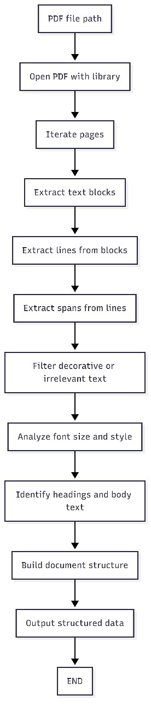

# PDF Heading Extractor

A Python-based tool to extract structured headings and outlines from PDF documents using PyMuPDF. This tool detects headings (H1, H2, H3) by analyzing font sizes, styles, and positions of text spans, optionally extracting the section text below each heading.

## Table of Contents
- [How to Run (Docker)](#how-to-run-docker)
    - [1. Build the Docker Image](#1-build-the-docker-image)
    - [2. Prepare Input Files](#2-prepare-input-files)
    - [3. Run the Container](#3-run-the-container)
    - [4. Find Your Output](#4-find-your-output)
- [Overview](#overview)
- [How It Works](#how-it-works)
- [Project Structure](#project-structure)
- [Diagram](#diagram)
- [Output Format](#output-format)

## How to Run (Docker)

### 1. Build the Docker Image

Open a terminal in your project directory and run:

```bash
docker build -t pdf-heading-extractor .
```

### 2. Prepare Input Files

- Place your PDF files in a local folder, e.g., `/input`.

### 3. Run the Container

Mount your local input and output folders to the Docker container:

```bash
docker run --rm -v /input:/app/input -v /output:/app/output pdf-heading-extractor
```

- All PDF files in `/input` will be processed.
- Extracted outlines (as `.json` files) will be saved to `/output`.

**Note:**  
- The `/app/input` and `/app/output` folders are used inside the Docker container.
- Ensure your input PDF files are in the mounted `/input` directory before running.

### 4. Find Your Output

- Look for the generated `.json` files in your specified `/output` directory after processing completes.

## Overview

Many PDF documents lack semantic headings or outline information. **PDF Heading Extractor** reconstructs a document’s hierarchy by analyzing font properties, boldness, indentation, and alignment. The tool classifies headings as H1, H2, or H3, and can group section body text under each heading.

## How It Works

1. **Parsing PDF Text Spans:**  
   Each PDF page is processed with PyMuPDF. Text spans (chunks of uniformly formatted text) are collected, recording font family, size, style, coordinates, and boldness.

2. **Filtering Decorative Text:**  
   Decorative elements (e.g., letter lines, long dashes, or too-short fragments) are ignored to focus only on meaningful text.

3. **Adjusting for Boldness:**  
   Font sizes are increased slightly for bolded text spans to help distinguish headings from body text.

4. **Dynamic Thresholds:**  
   Indentation and vertical gaps between text blocks are assessed using median values to tune heading and section groupings.

5. **Mapping Font Sizes:**  
   The top three largest unique font sizes (after adjustment) are mapped to heading levels H1, H2, and H3.

6. **Outline Construction:**  
   Consecutive spans with the same style, size, and nearby positions are merged into a single heading. The outline is then organized hierarchically.

7. **Section Text Extraction (Optional):**  
   If enabled, the body text under each heading is extracted and attached to the output.

## Project Structure

```
/app
│
├── extract_headings.py        # Heading extraction logic
├── process_pdfs.py            # Batch processor for input PDFs
├── requirements.txt           # Python dependency list
├── Dockerfile                 # Container configuration
├── input/                     # Place your input PDF files here
└── output/                    # Output JSON files are written here
```

## Diagram




## Output Format

Each processed PDF generates a JSON file in the output directory with:

- `title`: The document’s main title (gathered from top page headings)
- `outline`: List of detected headings. Each heading contains:
    - `level`: H1, H2, or H3
    - `text`: The heading text
    - `page`: PDF page number where the heading appears
    - (optionally) `text_content`: Section body text under this heading (if enabled in code)

**Example:**

```json
{
    "title": "Sample Document Title",
    "outline": [
        {
            "level": "H1",
            "text": "Introduction",
            "page": 1
        },
        {
            "level": "H2",
            "text": "Background",
            "page": 2
        }
    ]
}
```